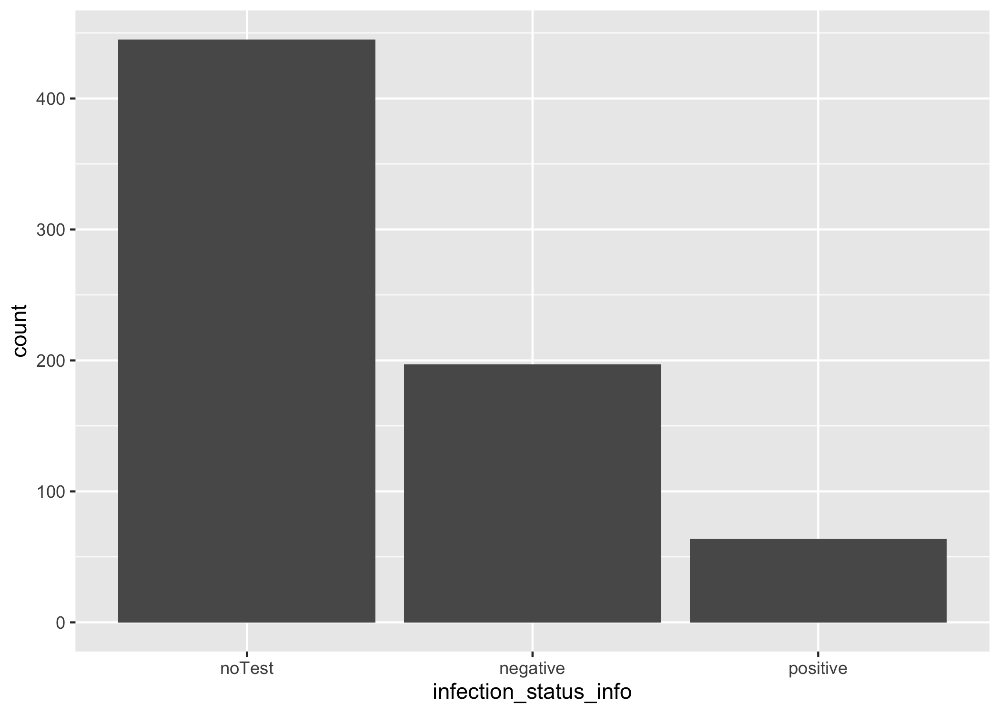

# Summary/Abstract
**Objective:** The COVID-19 testing situation in Bangladesh was controlled with various social measures. Much of the information covered in the media and in studies focused on the public health and economic aspects of the pandemic. This study aimed to explore the testing decision influences of  adult people, which is important especially in an young society categorised as low income or middle income due to the limits of economic and healthcare resources.

**Setting:** The impact of COVID-19 on adult persons in Bangladesh, an online survey, taken across the six regions of the country.

**Participants:** Total 759 adults (median age 45 years, interquartile range 33-57 years, range 18-93 years), participated in the study. COVID-19 testing/infection status was assessed by self-report.

**Outcome measures:** The analysis focused on the the knowledge of young adults of their infection status based on testing during the pandemic using logistic regression analysis.

**Results:** Of the 759 participants, 37% had tested for COVID-19, 9% tested positive, and 28.0% tested negative. In a logistic regression model, predisposing factors (Age, being female, having at least one chronic condition) and enabling/disabling factors (urban residence, higher perceived economic status) increased the odds of COVID-19 testing. Among those who were tested, participants residing in Bangladesh, those who had moderate to to severe psychological distress were positively associated with COVID-19 positive diagnosis. 

**Conclusion:** Observing the status of the infection knowledge of the adult population is important for introducing policies that can improve their decision on testing.

**Keywords:** COVID-19; public health; social medicine.


# Introduction 

Testing can help people determine if they are infected with SARS-CoV-2 – regardless of whether they have symptoms – and whether they are at risk of spreading the infection to others. Testing of all people for SARS-CoV-2, including those who have no symptoms, who show symptoms of infection, and who may have been exposed to the virus can help prevent the spread of COVID-19 and identify people in need of care in a timely fashion. A positive test early in the course of the illness enables individuals to isolate themselves – reducing the chances of infecting others and allowing them to seek treatment earlier, likely reducing disease severity and the risk of long-term disability, or death.

A negative test does not mean the person will not be able to acquire and transmit the infection in the future. Therefore, even if an individual is test negative, continuation of hygiene practices to self-protect and others by washing hands with soaps/ sanitizers frequently, physical distancing, and wearing a face mask is required. A positive test means isolation is mandatory, and that others with whom the individual may have been in contact since the time of exposure should also get tested. Since it is recognized that nearly half of all SARS-CoV-2 infections are transmitted by pre-symptomatic and asymptomatic people, identifying infected individuals while they are pre-symptomatic, as well as those who are asymptomatic, will play a major role in containing the pandemic.
	
Scanty research has been conducted to identify factors associated with the uptake of COVID-19 testing. In a cross-sectional community survey in Ontario, Canada, 3.3% tested positive for SARS-CoV-2. The odds of being tested increased with age, male sex, several underlying health conditions, previous use of health care services, and higher household income [@SundaramE]. Comparing the odds of COVID-19 positive diagnosis with test-negatives and untested individuals, older age, certain comorbidities, such as hypertension, diabetes and heart diseases, higher previous use of health care services were associated with increased odds of a positive SARS-CoV-2 test result [@SundaramE]. Using UK biobank data, being tested for COVID-19 was associated with male sex, Black ethnicity, lower socioeconomic status, occupation (being a health care worker, retired, unemployed), ever smoker, comorbidities, and exposure to particulate matter (PM) 2.5 absorbance [@Chadeau-hyam]. Among tested individuals, only male sex, non-White ethnicity, and lower education and none of the comorbidities or health risk factors were associated with a COVID-19 positive diagnosis [Chadeau-Hyam]. Workers in the healthcare sector are also at a higher risk of testing positive. A meta-analytic study showed that the pooled prevalence of healthcare workers testing positive for COVID-19 was between 7 to 11% [@Gomez-Ochoa]. 

## General Background Information
This study aimed to investigate, using the Andersen’s model of health care utilization, factors associated with COVID-19 testing among adults in Bangladesh.

## Description of data and data source
This will be a descriptive cross-sectional online study. To get data for this study, between 10 December 2020 and 9 February 2021 an online survey was organized in Bangladesh. In total 759 adults (median age 45 years, interquartile range 33-57 years, range 18-93 years), participated in the study. COVID-19 testing/infection status was assessed by self-report.

## Questions/Hypotheses to be addressed
The main question is to find out the key factors associated with covid-19 testing decision. There are several predisposing factors, enabling factors, disabling factors, need for care factors and we aim to find out which of them significantly plays a role behind an individual's decision to get tested for covid.


# Methods and Results

_**Study design, sample, and procedure:**_

This will be a descriptive cross-sectional online study conducted in Bangladesh between 10 December 2020 to 9 February 2021. Participant inclusion criteria were 18 years and older, any gender, and provision of electronic informed consent. 

_**Measures:**_
Using Andersen’s model of health care utilization , study variables will be categorized into outcome variable, predisposing factors, enabling/disabling factors and need for care factors.

_**Outcome variable:**_
COVID-19 testing/infection status will be assessed with the question, “Since the beginning of the COVID-19 outbreak, do you have information on your infection status?” Response options were 1=not tested/does not know test results, 2=negative, and 3=positive.

_**Predisposing factors:**_
Sociodemographic factors included age, sex, country of residence, educational level, and the (estimated) age(s) of their housemate(s). Chronic/underlying diseases includs heart disease, hypertension, diabetes, cancer, HIV, tuberculosis, and chronic asthma; coded as “0” none and “1” at least presence of one clinically diagnosed condition.

_**COVID-19 preventive measures:**_
Participants were asked, “During the past 7 days, have you been observing any of the following preventive measures against COVID-19? 1) Social distancing of at least 1.5m, 2) Wearing a face mask, 3) Hand hygiene (regular handwashing with soap or using hand gel), and 4) Coughing hygiene (covering the mouth when coughing or sneezing). A composite non-adherence to all four COVID-19 preventive measure was calculated by coding each negative response with “1”, summing scores ranging from 0-4 (Cronbach’s alpha 0.7).

_**Enabling factors:**_
Enabling factors include self-perceived socio-economic status, self-perceived area of residence, being a student or worker in the health care sector, source of COVID-19 information/advice most trusted (coded as other, including family and friends, radio/TV, social media, religious authorities and health personnel[@Bono].

_**Need for care factors:**_ include two questions on 1) the level of fear/worry of being infected with COVID-19 (ranging from 1=not at all worried to 5=extremely worried), and 2) having been quarantined (either at home or elsewhere) at any point in time during the COVID-19 epidemic.

_**Data analysis procedure**_

Descriptive statistics will be used to describe the study population. Logistic regression will be used to assess associations between predisposing factors, enabling and disabling factors, need of care factors and COVID-19 testing status, COVID-19 positive versus negative status and COVID-19 positive versus negative and not tested status. Variables significant at <0.05 in univariate analyses were subsequently included in the multivariable logistic regression models. Statistical analyses will conducted using R.


## Data Analysis:
---
First of all, let's have a look at the overall descriptive status of the participants.
```{r}
library(here)
resulttable=readRDS("../../results/Overall.rds")
knitr::kable(resulttable, caption = "**Overall Descriptive Statistics of the Participants**")
```
Among the participants, **78.9%** are less than or equal  to 35 years old. That indicates that majority of the participants tend to be younger. While **45.18%** of the participants were female, **54.82%** were male, which shows less chance of bias due to sex. **78.05%** of the participants had a bachelor or post-bachelor degree, clearly indicating that majority of the participants had pretty good education background. Almost **50%** of the participants belongs to "upper middle income category", indicating that at least half of the participants don't belong to the poorer side. Less than **10%** of the participants live in a village/rural area. Health professionals and Tv/radio seems to be the most trusted source to the participants. Apparently equal half of the participants worked from home or not at some stage of the study. Major half of the participants did quarantine at some stage during the study. **63%** of the participants didn't go through a COVID test. Almost half of the participants **(46%)** were moderate or more worried about reinfection. Only **22%** of the participants recorded to have some sort of chronic disease. **(Separate analysis for each variable was done and the data can be accessed/viewed through the "supplementary.rmd" file)**


As the infection status information of the participants is the _**main outcome variable**_, let's see its distribution among the participants:

```{r resultfigure,  fig.cap='Infection Status Information.', echo=FALSE}

```
So, among 759 participants, 445 didn't have any test. 197 was tested positive and 64 was tested negative. Clearly, there is major difference in number between the group who have gone through testing and who haven't. Our main focus is to find out which factors are affecting their decision whether they want to get tested or not.

Let's look at the univariate logistic regression analysis and its statistics summary between the **outcome variable** (infection status info) and the three key **predisposing factors** (Age, Sex, Education level).
```{r summarytable12,  echo=FALSE}
resulttable=readRDS("../../results/lg_fit_table_predisposing.rds")
knitr::kable(resulttable, caption = "logistic regression betweem infection status and Key Predisposing Factors")
```

Here, all three predisposing factors (Age, Sex and Education level) seems to have a significant effect on the participants' decision making to get tested or not as the p-values are <0.05. The quality of this model selection has been supported by the statistical data shown below:

```{r summarytable13,  echo=FALSE}
resulttable=readRDS("../../results/lg_fit_statistics_predisposing.rds")
knitr::kable(resulttable, caption = "logistic regression statistics betweem infection status and Key Predisposing Factors")
```


Next, we want to see the univariate logistic regression analysis statistics between the **outcome variable** (infection status info) and the three key **enabling factors** (socio economic status, area of residence,student/healthworker, source of covid news).

```{r summarytable14,  echo=FALSE}
resulttable=readRDS("../../results/lg_fit_table_enabling.rds")
knitr::kable(resulttable, caption = "logistic regression  betweem infection status and Key Enabling Factors")
```

While, difeerent socio economic status and residence area have strong importance on the testing decision making, the source of their covid information didn't seem to affect their decision making much. The quality of this model selection has been supported by the statistical data shown below:

```{r summarytable15,  echo=FALSE}
resulttable=readRDS("../../results/lg_fit_statistics_enabling.rds")
knitr::kable(resulttable, caption = "logistic regression statistics betweem infection status and Key enabling Factors")
```

Next, we want to see the logistic regression analysis statistics between the **outcome variable** (infection status info) and the level of fear of infection and quarantined or not **(Key need for care factors )** 

```{r summarytable16,  echo=FALSE}
resulttable=readRDS("../../results/lg_fit_table_needforcare.rds")
knitr::kable(resulttable, caption = "logistic regression  betweem infection status and Key Need for care Factor")
```

Their worry level seems to have affect their decision to get tested for covid.The quality of this model selection has been supported by the statistical data shown below:

```{r summarytable17,  echo=FALSE}
resulttable=readRDS("../../results/lg_fit_statistics_needforcare.rds")
knitr::kable(resulttable, caption = "logistic regression statistics betweem infection status and Key Need for Care Factors")
```

The comparison between these three models give us this information:

```{r summarytable18,  echo=FALSE}
resulttable=readRDS("../../results/Comparison of Models.rds")
knitr::kable(resulttable, caption = "Comparison of the Models")
```


we want to predict each infection status level, not a single contrast by using multinom_reg(). The result is as following:

```{r summarytable19,  echo=FALSE}
resulttable=readRDS("../../results/Metrices of Training Data.rds")
knitr::kable(resulttable, caption = "Metrices of Training Data")
```

```{r summarytable20,  echo=FALSE}
resulttable=readRDS("../../results/Metrices of TestData.rds")
knitr::kable(resulttable, caption = "Metrices of Testing Data")
```

# Discussion

## Results

In total, 759 participants were included in the study with mean age 30.70 years. Of these 63% had never tested for COVID-19, 28% tested positive and 9.0% tested negative

**Predisposing factor**

One in five participants (20.1%) were 35 years and older, 45.18% were female, 78% had a graduate/postgraduate education, 21.5% had at least one diagnosed chronic/underlying disease, and only 2.1% did not adhere to the any of the four COVID-19 preventive measures.

**Enabling/disabling factors**

Most participants (63.03%) resided in urban areas, 56.0% rated their socio-economic status as upper middle to high-income, and 32% were students or workers in health care. The most trusted source of COVID-19 information/advice was health care personnel (33.5%), 37% had correct COVID-19 knowledge, and 46% reported moderate to severe psychological distress.

**Need for care factors**

More than half of the participants (70.7%) were very or extremely worried about being (re)infected with COVID-19, and 57.64% had been quarantined during the COVID-19 pandemic (see Table 1 and exploratory.rmd).

**Associations**

In the logistic regression model, predisposing factors (Age, Sex, Education Level) and enabling/disabling factors (urban residence, higher perceived economic status, being a student or worker in the health care sector) increased the odds of COVID-19 testing.Also, multivariate logistic regression of the odds of a COVID-19 positive diagnosis among all individuals tested or not tested found that urban residence, higher perceived economic status were positively associated with a COVID-19 positive diagnosis.


## Strengths and Limitations
Our study respondents cannot be considered representative of the general population in the study country, since respondents needed to have had access to the internet to participate in the online survey. Moreover, self-reports, including the outcome variable COVID-19 testing, may be influenced by recall bias and social desirability. We also have no information on the type of test used for COVID-19 testing, limiting the accuracy and authenticity of the test results. Some variables, such as COVID-19 symptoms, previous use of health care services, obesity, and smoking, that have been found affecting COVID-19 testing uptake [@Chadeau-hyam] were not assessed in this survey and should be included in future studies.

## Conclusions
This study among adults across Bangladesh reported a high prevalence of COVID-19 testing. Factors associated with COVID-19 testing included some predisposing factors (residing , postgraduate education, having at least one chronic condition) and enabling/disabling factors (urban residence, higher perceived economic status, being a student or worker in the health care sector, and moderate or severe psychological distress). Identified predisposing and enabling or disabling factors can be used to design programmes to improve COVID-19 testing uptake. Access to testing needs to be increased for persons living in Bangladesh and similar resource poor settings. In addition, COVID-19 testing programs need to target persons of lower economic status and of lower education level who currently less tested but most at risk for COVID-19 infection.


# References


