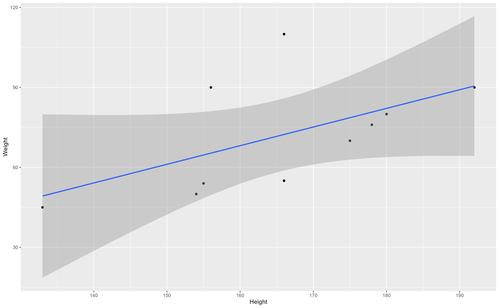

The structure below is a possible setup for a data analysis project (including the course project). For a manuscript, adjust as needed.


# Summary/Abstract
_Write a summary of your project._


# Introduction 

## General Background Information
This study aimed to investigate, using the Andersen’s model of health care utilization, factors associated with COVID-19 testing among adults in Bangladesh.

## Description of data and data source
This will be a descriptive cross-sectional online study. To get data for this study, between 10 December 2020 and 9 February 2021 an online survey was organized in Bangladesh. In total 759 adults (median age 45 years, interquartile range 33-57 years, range 18-93 years), participated in the study. COVID-19 testing/infection status was assessed by self-report.

## Questions/Hypotheses to be addressed
The main question is to find out the key factors associated with covid-19 testing


# Methods and Results

_Study design, sample, and procedure_

This will be a descriptive cross-sectional online study conducted in Bangladesh between 10 December 2020 to 9 February 2021. Participant inclusion criteria were 18 years and older, any gender, and provision of electronic informed consent. 

_Measures_
Using Andersen’s model of health care utilization [Andersen 1995], study variables will be categorized into outcome variable, predisposing factors, enabling/disabling factors and need for care factors.

_Outcome variable_
COVID-19 testing/infection status will be assessed with the question, “Since the beginning of the COVID-19 outbreak, do you have information on your infection status?” Response options were 1=not tested/does not know test results, 2=negative, and 3=positive.

_Predisposing factors_
Sociodemographic factors included age, sex, country of residence, educational level, and the (estimated) age(s) of their housemate(s). Chronic/underlying diseases includs heart disease, hypertension, diabetes, cancer, HIV, tuberculosis, and chronic asthma; coded as “0” none and “1” at least presence of one clinically diagnosed condition.

_COVID-19 preventive measures_
Participants were asked, “During the past 7 days, have you been observing any of the following preventive measures against COVID-19? 1) Social distancing of at least 1.5m, 2) Wearing a face mask, 3) Hand hygiene (regular handwashing with soap or using hand gel), and 4) Coughing hygiene (covering the mouth when coughing or sneezing). A composite non-adherence to all four COVID-19 preventive measure was calculated by coding each negative response with “1”, summing scores ranging from 0-4 (Cronbach’s alpha 0.7).

_Enabling/disabling factors_
Enabling factors include self-perceived socio-economic status, self-perceived area of residence, being a student or worker in the health care sector, source of COVID-19 information/advice most trusted (coded as other, including family and friends, radio/TV, social media, religious authorities and health personnel.

_Disabling factors_ include the assessment of psychological distress with the Patient Health Questionnaire (PHQ-4) for Depression and Anxiety symptoms [Kroenke/ Löwe]. The severity of psychological distress is categorized as normal (0-2), mild (3-5). moderate (6-8) and severe (9-12) based on the PHQ-4 scores.

_Need for care factors_ include two questions on 1) the level of fear/worry of being infected with COVID-19 (ranging from 1=not at all worried to 5=extremely worried), and 2) having been quarantined (either at home or elsewhere) at any point in time during the COVID-19 epidemic.

_Data analysis_

Descriptive statistics will be used to describe the study population. Logistic regression will be used to assess associations between predisposing factors, enabling and disabling factors, need of care factors and COVID-19 testing status, COVID-19 positive versus negative status and COVID-19 positive versus negative and not tested status. Variables significant at <0.05 in univariate analyses were subsequently included in the multivariable logistic regression models. Statistical analyses will conducted using R.


## Data aquisition
_As applicable, explain where and how you got the data. If you directly import the data from an online source, you can combine this section with the next._

## Data import and cleaning_ [Here I mostly covered descriptive analysis]
---
title: "try"
author: "Ehsan"
date: "10/6/2021"
output: html_document
---
```{r}
library(ggplot2)
library(tidyverse)
library("readxl")
```

```{r}
data1 <- readxl::read_excel('~/Study /MADA_2021/EhsanSuez-MADA-project/data/raw_data/Covid Vaccine data_Bangladesh_Abu_Sayeed.xlsx')
```

#I want to see how many NA values are there for each column. So, I wrote the following code. For manuscript we dont need it.
#```{r}
cbind(
      lapply(
             lapply(data1, is.na)
             , sum)
  )
#
#I want to see which columns have NA values
```{r}
df <- as.data.frame(
      cbind(
             lapply(
                   lapply(data1, is.na), sum)
        )
   )
rownames(subset(df, df$V1 != 0))
```
#the mean age and SD of mean age:
```{r}
mean(data1$Age)
sd(data1$Age)
```
#For each age group, whats their percentage?
```{r}
data1 %>% 
     group_by( Age ) %>% 
     summarise( percent = 100 * n() / nrow( data1) )
```
#number of male and female
```{r}
sum(data1$Sex=='Male')
sum(data1$Sex=='Female')
```
#percentage of male and female
```{r}
data1 %>% 
     group_by( Sex ) %>% 
     summarise( percent = 100 * n() / nrow( data1) )

```
#number of people for each educational category
```{r}
table(data1$`Highest educational level`)
```
```{r}
sum(data1$'Highest educational level' == 'Primary')
sum(data1$'Highest educational level' == 'Secondary')
sum(data1$'Highest educational level' == 'University Postgraduate degree holder')
sum(data1$'Highest educational level' == 'University Undergraduate degree holder')
```
#percentage of people for each student category
```{r}
data1 %>% 
     group_by( `Highest educational level` ) %>% 
     summarise( percent = 100 * n() / nrow( data1) )
```
#student/worker in the heathcare sector?
```{r}
table(data1$`Are you a student or worker in the healthcare sector?`)
```
#household members?
```{r}
table(data1$`Who do you currently live with in the same household? Please select the number of persons in each age category.: 60 years and above`)
table(data1$`Who do you currently live with in the same household? Please select the number of persons in each age category.: 18 to 59 years`)
table(data1$`Who do you currently live with in the same household? Please select the number of persons in each age category.: 12 to 17 years`)
table(data1$`Who do you currently live with in the same household? Please select the number of persons in each age category.: Less than 12 years`)
```
```{r}
table(data1$`Which of the following categories best describes your current socio-economic situation?`)
```
```{r}
sum(data1$'Which of the following categories best describes your current socio-economic situation?' == 'High income category')
sum(data1$'Which of the following categories best describes your current socio-economic situation?' == 'Low income category')
sum(data1$'Which of the following categories best describes your current socio-economic situation?' == 'Lower middle income category')
sum(data1$'Which of the following categories best describes your current socio-economic situation?' == 'Upper middle income category ')
```

#percentage of income category?
```{r}
data1 %>% 
     group_by( `Which of the following categories best describes your current socio-economic situation?` ) %>% 
     summarise( percent = 100 * n() / nrow( data1) )
```
```{r}
table(data1$`Do you live in:`)
```
```{r}
sum(data1$'Do you live in:' == 'A rural place / village')
sum(data1$'Do you live in:' == 'A Sub-urban setting / urban slum')
sum(data1$'Do you live in:' == 'An urban setting / city / town')
```
#percentage of living setup?
```{r}
data1 %>% 
     group_by( `Do you live in:` ) %>% 
     summarise( percent = 100 * n() / nrow( data1) )
```
```{r}
table(data1$`Which source of COVID-19 information/advice do you trust the most?`)
```

```{r}
sum(data1$'Are you currently working/studying from home because of the COVID-19 outbreak?' == 'No')
sum(data1$'Are you currently working/studying from home because of the COVID-19 outbreak?' == 'Yes')
```

#percentage of work from home or not?
```{r}
data1 %>% 
     group_by( `Are you currently working/studying from home because of the COVID-19 outbreak?` ) %>% 
     summarise( percent = 100 * n() / nrow( data1) )
```
#Descriptive analysis for each question?
```{r}
table(data1$`Have you been quarantined (either at home or else where) at any point in time during the Covid-19 epidemic?`)
```
```{r}
table(data1$`Since the beginning of the COVID-19 outbreak, do you have information on your infection status?`)
```
```{r}
table(data1$`How worried/fearful are you about becoming (re)infected by the coronavirus?: On a scale of 1 to 5`)
```
```{r}
table(data1$`Do you have any of the following chronic/underlying diseases? (many answers possible): Heart disease`)
```
```{r}
table(data1$`Do you have any of the following chronic/underlying diseases? (many answers possible): Hypertension`)
```
```{r}
table(data1$`Do you have any of the following chronic/underlying diseases? (many answers possible): Diabetes`)
```
```{r}
table(data1$`Do you have any of the following chronic/underlying diseases? (many answers possible): Cancer`)
```
```{r}
table(data1$`Do you have any of the following chronic/underlying diseases? (many answers possible): HIV`)
```
```{r}
table(data1$`Do you have any of the following chronic/underlying diseases? (many answers possible): Tuberculosis`)
```
```{r}
table(data1$`Do you have any of the following chronic/underlying diseases? (many answers possible): Asthma`)
```
```{r}
table(data1$`Do you have any of the following chronic/underlying diseases? (many answers possible): None of the above`)
```
```{r}
table(data1$`During the past 7 days, have you been observing any of the following preventive measures against COVID-19? (Tick all answers that apply): Social distancing of at least 1.5m`)
```
```{r}
table(data1$`During the past 7 days, have you been observing any of the following preventive measures against COVID-19? (Tick all answers that apply): Wearing face mask`)
```
```{r}
table(data1$`During the past 7 days, have you been observing any of the following preventive measures against COVID-19? (Tick all answers that apply): Hand hygiene (regular handwashing with soap or using hand gel)`)
```
```{r}
table(data1$`During the past 7 days, have you been observing any of the following preventive measures against COVID-19? (Tick all answers that apply): Coughing hygiene (covering mouth when coughing or sneezing)`)
```
```{r}
table(data1$`During the past 7 days, have you been observing any of the following preventive measures against COVID-19? (Tick all answers that apply): None of the above`)
```
```{r}
table(data1$`During the past two weeks, how often have you been bothered by each of the following symptoms?: Feeling down, depressed, or hopeless (low spirits)`)
```
```{r}
table(data1$`During the past two weeks, how often have you been bothered by each of the following symptoms?: Little interest or pleasure in doing things`)
```
```{r}
table(data1$`During the past two weeks, how often have you been bothered by each of the following symptoms?: Not being able to stop or control worrying`)
```
```{r}
table(data1$`During the past two weeks, how often have you been bothered by each of the following symptoms?: Feeling nervous, anxious or on edge`)
```
```{r}
table(data1$`In your opinion, can someone be re-infected with coronavirus after recovering from a previous COVID-19 infection?`)
```
```{r}
table(data1$`In your opinion, can COVID-19 infection be prevented by a vaccine?`)
```
```{r}
table(data1$`To the best of your knowledge, is there currently an effective vaccine against COVID-19?`)
```
```{r}
table(data1$`Would you be willing to take the COVID-19 vaccine when it becomes available?: If it is at least 50% effective`)
```
```{r}
table(data1$`Would you be willing to take the COVID-19 vaccine when it becomes available?: If it is at least 75% effective`)
```
```{r}
table(data1$`Would you be willing to take the COVID-19 vaccine when it becomes available?: If it is at least 90% effective`)
```
```{r}
table(data1$`Would you be willing to allow your children take the COVID-19 vaccine when it becomes available?: If it is at least 95% effective`)
```
```{r}
table(data1$`What are some of the possible reasons why you would hesitate to take the COVID-19 vaccine? (many answers possible):  I don't think COVID-19 existsists`)
```
```{r}
table(data1$`What are some of the possible reasons why you would hesitate to take the COVID-19 vaccine? (many answers possible): I think the vaccine is not effective`)
```
```{r}
table(data1$`What are some of the possible reasons why you would hesitate to take the COVID-19 vaccine? (many answers possible): I think the vaccine is designed to harm us`)
```
```{r}
table(data1$`What are some of the possible reasons why you would hesitate to take the COVID-19 vaccine? (many answers possible): I am scared of side-effects of the vaccine`)
```
```{r}
table(data1$`What are some of the possible reasons why you would hesitate to take the COVID-19 vaccine? (many answers possible): My body is naturally strong, I don't need a vaccine to fight COVID-19`)
```
```{r}
table(data1$`What are some of the possible reasons why you would hesitate to take the COVID-19 vaccine? (many answers possible): I already had COVID-19, so I think I am immune to the disease`)
```
```{r}
table(data1$`What are some of the possible reasons why you would hesitate to take the COVID-19 vaccine? (many answers possible): The COVID-19 pandemic is finished in my country, no need for a vaccine now`)
```
```{r}
table(data1$`What are some of the possible reasons why you would hesitate to take the COVID-19 vaccine? (many answers possible): None of the above`)
```
```{r}
table(data1$`What are some of the possible reasons why you would hesitate to take the COVID-19 vaccine? (many answers possible): Other reasons (please specify)`)
```
```{r}
table(data1$`Please specify other reasons for hesitating to receive the COVID-19 vaccine:`)
```
```{r}
table(data1$`How important is it to you that by getting the COVID-19 vaccine, you would protect your own health?: On a scale of 1 to 5`)
```
```{r}
table(data1$`How important is it to you that by getting the COVID-19 vaccine, you would protect the health of other people in your community?: On a scale of 1 to 5`)
```
```{r}
table(data1$`I fully understand what this study is about, and I freely consent to participate. All the information I provide can be used by researchers to better understand coronavirus disease in my country.`)
```


## Exploratory analysis

_Use a combination of text/tables/figures to explore and describe your data. You should produce plots or tables or other summary quantities for the most interesting/important quantities in your data. Depending on the total number of variables in your dataset, explore all or some of the others. FIgures produced here might be histograms or density plots, correlation plots, etc. Tables might summarize your data._

_Continue by creating plots or tables of the outcome(s) of interest and the predictor/exposure/input variables you are most interested in. If your dataset is small, you can do that for all variables. Plots produced here can be scatterplots, boxplots, violinplots, etc. Tables can be simple 2x2 tables or larger ones._

_To get some further insight into your data, if reasonable you could compute simple statistics (e.g. t-tests, simple regression model with 1 predictor, etc.) to look for associations between your outcome(s) and each individual predictor variable. Though note that unless you pre-specified the outcome and main exposure, any "p<0.05 means statistical significance" interpretation is not valid._

Table \@ref(tab:summarytable) shows a table summarizing the data.


#```{r summarytable,  echo=FALSE}
#resulttable=readRDS("../../results/summarytable.rds")
#knitr::kable(resulttable, caption = 'Data summary table.')
#```


Figure \@ref(fig:resultfigure) shows a scatterplot figure produced by one of the R scripts.

#```{r resultfigure,  fig.cap='Analysis figure.', echo=FALSE}
#
#```


## Full analysis

_Use one or several suitable statistical/machine learning methods to analyze your data and to produce meaningful figures, tables, etc. This might again be code that is best placed in one or several separate R scripts that need to be well documented. You want the code to produce figures and data ready for display as tables, and save those. Then you load them here._

Example table \@ref(tab:resulttable) shows a table summarizing a linear model fit.

###```{r resulttable,  echo=FALSE}
###resulttable=readRDS("../../results/resulttable.rds")
###knitr::kable(resulttable, caption = 'Linear model fit table.')
#```


# Discussion

## Summary and Interpretation
_Summarize what you did, what you found and what it means._

## Strengths and Limitations
_Discuss what you perceive as strengths and limitations of your analysis._

## Conclusions
_What are the main take-home messages?_

_Include citations in your Rmd file using bibtex, the list of references will automatically be placed at the end_

This paper [@Leek2015a] discusses types of analyses. 

Note that this cited reference will show up at the end of the document, the reference formatting is determined by the CSL file specified in the YAML header. Many more style files for almost any journal [are available](https://www.zotero.org/styles). You also specify the location of your bibtex reference file in the YAML. You can call your reference file anything you like, I just used the generic word `references.bib` but giving it a more descriptive name is probably better.


# References


